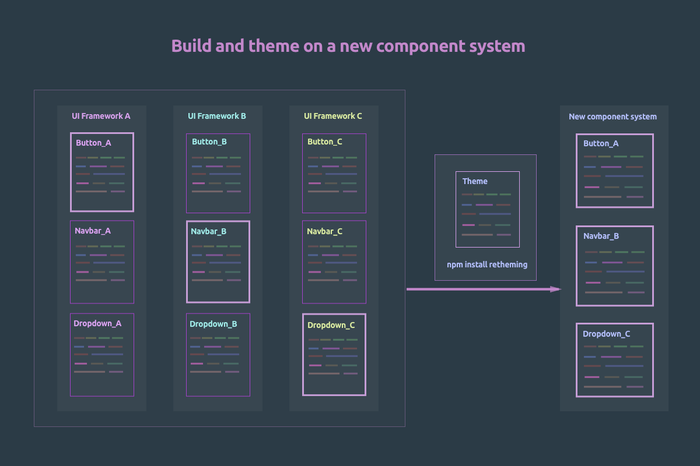

<h1 align="center">React retheming</h1>

<div align="center">

### A JavaScript library of building your own React UI frameworks with minimum effort.

<br />

[](https://codecov.io/gh/loveloper/react-retheming/branch/master)


</div>

## Project motivation

- Designers can specify their own design values on top of mainstream React component libraries;
- Developers can build up React component libraries on top of the design values, by combining components chosen from React frameworks and independent component libraries with minimum efforts;
- Themes can be easily customized and reused;



## Get started with [styled-components](https://github.com/styled-components/styled-components)

### **1. Import retheming object in ThemeProvider**

```js
import React from 'react';
import { ThemeProvider } from 'styled-components';

// Import theme object which contains utils to retheme components, as well as default colors
import theme from 'react-retheming';

<ThemeProvider {...{ theme }}>{children}</ThemeProvider>;
```

### **2. Retheme components**

```jsx
import React from 'react';
import PropTypes from 'prop-types';
import styled from 'styled-components';

// Initialise component default retheming styles
const initRethemingStyles = ({ theme: { colors } }) => ({
  background: colors.red.500,
});

// Compose retheming styles to be used in styled components
const rethemingStyles = theme.utils.rethemeComponent(initRethemingStyles);

const MyFuncyComponent = styled.div`
  /** Apply retheming styles */
  background: ${(p) => rethemingStyles(p).background},
`;

export default MyFuncyComponent;
```
